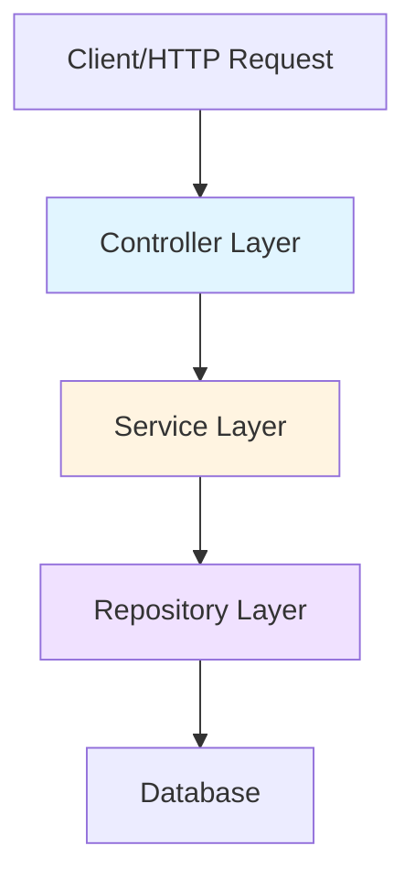
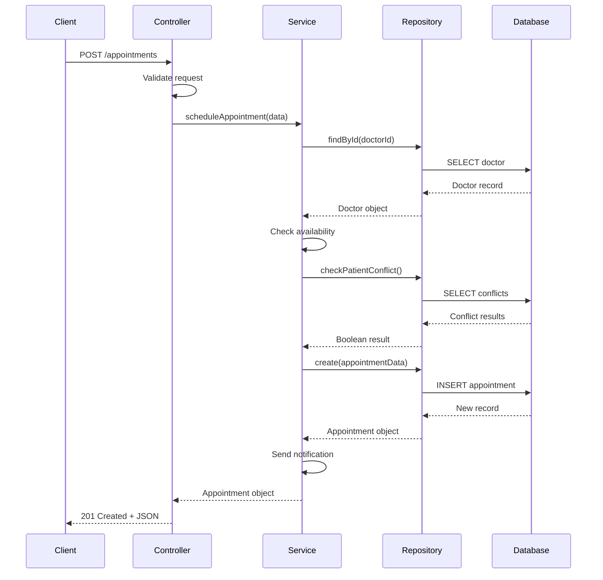

# Architecture Overview

<Note>
This describes the intended architectural design for SaludYa API. Implementation is in progress.
</Note>

SaludYa API is designed to follow a clean, layered architecture pattern that promotes separation of concerns, maintainability, and testability. The architecture is divided into three main layers: Controller, Service, and Repository.

## Layered Architecture Pattern

<Info>
The layered architecture ensures that each component has a single responsibility and depends only on the layer directly below it.
</Info>



## Layer Responsibilities

### Controller Layer

The Controller layer is responsible for handling HTTP requests and responses. It acts as the entry point for all API operations.

**Responsibilities:**
- Receive and validate HTTP requests
- Extract request parameters, body, and headers
- Call appropriate service methods
- Format responses and set HTTP status codes
- Handle request-level errors

**Example: Appointment Controller**

```javascript
// controllers/appointmentController.js
class AppointmentController {
  constructor(appointmentService) {
    this.appointmentService = appointmentService;
  }

  async createAppointment(req, res) {
    try {
      const { patientId, doctorId, dateTime, reason } = req.body;
      
      // Validation happens at controller level
      if (!patientId || !doctorId || !dateTime) {
        return res.status(400).json({
          error: 'Missing required fields'
        });
      }

      // Delegate business logic to service
      const appointment = await this.appointmentService.scheduleAppointment({
        patientId,
        doctorId,
        dateTime,
        reason
      });

      return res.status(201).json({
        success: true,
        data: appointment
      });
    } catch (error) {
      return res.status(500).json({
        error: error.message
      });
    }
  }

  async getAppointment(req, res) {
    try {
      const { id } = req.params;
      const appointment = await this.appointmentService.getAppointmentById(id);
      
      if (!appointment) {
        return res.status(404).json({
          error: 'Appointment not found'
        });
      }

      return res.status(200).json({
        success: true,
        data: appointment
      });
    } catch (error) {
      return res.status(500).json({
        error: error.message
      });
    }
  }
}

module.exports = AppointmentController;
```

<Note>
Controllers should remain thin. Complex business logic should be delegated to the Service layer.
</Note>

### Service Layer

The Service layer contains the core business logic of the application. It orchestrates operations and enforces business rules.

**Responsibilities:**
- Implement business logic and rules
- Coordinate multiple repository operations
- Perform data transformations
- Handle business-level validations
- Manage transactions

**Example: Appointment Service**

```javascript
// services/appointmentService.js
class AppointmentService {
  constructor(appointmentRepository, doctorRepository, notificationService) {
    this.appointmentRepository = appointmentRepository;
    this.doctorRepository = doctorRepository;
    this.notificationService = notificationService;
  }

  async scheduleAppointment(appointmentData) {
    // Business rule: Check doctor availability
    const isDoctorAvailable = await this.checkDoctorAvailability(
      appointmentData.doctorId,
      appointmentData.dateTime
    );

    if (!isDoctorAvailable) {
      throw new Error('Doctor is not available at the requested time');
    }

    // Business rule: No overlapping appointments for patient
    const hasConflict = await this.appointmentRepository.checkPatientConflict(
      appointmentData.patientId,
      appointmentData.dateTime
    );

    if (hasConflict) {
      throw new Error('Patient already has an appointment at this time');
    }

    // Create appointment
    const appointment = await this.appointmentRepository.create({
      ...appointmentData,
      status: 'SCHEDULED',
      createdAt: new Date()
    });

    // Send confirmation notification
    await this.notificationService.sendAppointmentConfirmation(appointment);

    return appointment;
  }

  async checkDoctorAvailability(doctorId, dateTime) {
    const doctor = await this.doctorRepository.findById(doctorId);
    
    if (!doctor || !doctor.isActive) {
      return false;
    }

    const existingAppointments = await this.appointmentRepository.findByDoctorAndTime(
      doctorId,
      dateTime
    );

    return existingAppointments.length === 0;
  }

  async getAppointmentById(id) {
    return await this.appointmentRepository.findById(id);
  }

  async cancelAppointment(id, reason) {
    const appointment = await this.appointmentRepository.findById(id);
    
    if (!appointment) {
      throw new Error('Appointment not found');
    }

    // Business rule: Cannot cancel appointments less than 24 hours before
    const hoursBefore = (new Date(appointment.dateTime) - new Date()) / (1000 * 60 * 60);
    
    if (hoursBefore < 24) {
      throw new Error('Cannot cancel appointment less than 24 hours in advance');
    }

    const cancelledAppointment = await this.appointmentRepository.update(id, {
      status: 'CANCELLED',
      cancellationReason: reason,
      cancelledAt: new Date()
    });

    // Notify both patient and doctor
    await this.notificationService.sendCancellationNotification(cancelledAppointment);

    return cancelledAppointment;
  }
}

module.exports = AppointmentService;
```

<Warning>
Avoid putting database queries directly in services. Always use the Repository layer for data access.
</Warning>

### Repository Layer

The Repository layer provides an abstraction over data storage and retrieval. It handles all database operations.

**Responsibilities:**
- Execute database queries
- Map database records to domain models
- Handle database-specific logic
- Provide a consistent interface for data access

**Example: Appointment Repository**

```javascript
// repositories/appointmentRepository.js
class AppointmentRepository {
  constructor(database) {
    this.db = database;
  }

  async create(appointmentData) {
    const query = `
      INSERT INTO appointments (patient_id, doctor_id, date_time, reason, status, created_at)
      VALUES ($1, $2, $3, $4, $5, $6)
      RETURNING *
    `;
    
    const values = [
      appointmentData.patientId,
      appointmentData.doctorId,
      appointmentData.dateTime,
      appointmentData.reason,
      appointmentData.status,
      appointmentData.createdAt
    ];

    const result = await this.db.query(query, values);
    return this.mapToModel(result.rows[0]);
  }

  async findById(id) {
    const query = `
      SELECT a.*, 
             p.name as patient_name, p.email as patient_email,
             d.name as doctor_name, d.specialization
      FROM appointments a
      JOIN patients p ON a.patient_id = p.id
      JOIN doctors d ON a.doctor_id = d.id
      WHERE a.id = $1
    `;

    const result = await this.db.query(query, [id]);
    return result.rows.length > 0 ? this.mapToModel(result.rows[0]) : null;
  }

  async findByDoctorAndTime(doctorId, dateTime) {
    const query = `
      SELECT * FROM appointments
      WHERE doctor_id = $1
      AND date_time = $2
      AND status != 'CANCELLED'
    `;

    const result = await this.db.query(query, [doctorId, dateTime]);
    return result.rows.map(row => this.mapToModel(row));
  }

  async checkPatientConflict(patientId, dateTime) {
    const query = `
      SELECT COUNT(*) as count
      FROM appointments
      WHERE patient_id = $1
      AND date_time = $2
      AND status IN ('SCHEDULED', 'CONFIRMED')
    `;

    const result = await this.db.query(query, [patientId, dateTime]);
    return result.rows[0].count > 0;
  }

  async update(id, updateData) {
    const query = `
      UPDATE appointments
      SET status = COALESCE($2, status),
          cancellation_reason = COALESCE($3, cancellation_reason),
          cancelled_at = COALESCE($4, cancelled_at)
      WHERE id = $1
      RETURNING *
    `;

    const values = [
      id,
      updateData.status,
      updateData.cancellationReason,
      updateData.cancelledAt
    ];

    const result = await this.db.query(query, values);
    return this.mapToModel(result.rows[0]);
  }

  mapToModel(row) {
    return {
      id: row.id,
      patientId: row.patient_id,
      doctorId: row.doctor_id,
      dateTime: row.date_time,
      reason: row.reason,
      status: row.status,
      createdAt: row.created_at,
      patientName: row.patient_name,
      patientEmail: row.patient_email,
      doctorName: row.doctor_name,
      specialization: row.specialization,
      cancellationReason: row.cancellation_reason,
      cancelledAt: row.cancelled_at
    };
  }
}

module.exports = AppointmentRepository;
```

## Complete Request Flow

Here's how a complete request flows through all three layers:



## Dependency Injection

The architecture uses dependency injection to maintain loose coupling between layers:

```javascript
// app.js - Dependency injection setup
const Database = require('./config/database');
const AppointmentRepository = require('./repositories/appointmentRepository');
const DoctorRepository = require('./repositories/doctorRepository');
const NotificationService = require('./services/notificationService');
const AppointmentService = require('./services/appointmentService');
const AppointmentController = require('./controllers/appointmentController');

// Initialize dependencies
const db = new Database();
const appointmentRepo = new AppointmentRepository(db);
const doctorRepo = new DoctorRepository(db);
const notificationService = new NotificationService();

// Inject dependencies
const appointmentService = new AppointmentService(
  appointmentRepo,
  doctorRepo,
  notificationService
);

const appointmentController = new AppointmentController(appointmentService);

// Setup routes
app.post('/appointments', (req, res) => 
  appointmentController.createAppointment(req, res)
);
```

<Info>
Dependency injection makes unit testing easier by allowing you to inject mock dependencies.
</Info>

## Benefits of This Architecture

### Separation of Concerns
Each layer has a distinct responsibility, making the codebase easier to understand and maintain.

### Testability
Layers can be tested independently by mocking their dependencies:

```javascript
// Example: Testing Service layer
const AppointmentService = require('../services/appointmentService');

describe('AppointmentService', () => {
  let appointmentService;
  let mockAppointmentRepo;
  let mockDoctorRepo;
  let mockNotificationService;

  beforeEach(() => {
    mockAppointmentRepo = {
      create: jest.fn(),
      findById: jest.fn(),
      checkPatientConflict: jest.fn()
    };

    mockDoctorRepo = {
      findById: jest.fn()
    };

    mockNotificationService = {
      sendAppointmentConfirmation: jest.fn()
    };

    appointmentService = new AppointmentService(
      mockAppointmentRepo,
      mockDoctorRepo,
      mockNotificationService
    );
  });

  test('should schedule appointment when doctor is available', async () => {
    // Arrange
    mockDoctorRepo.findById.mockResolvedValue({ id: 1, isActive: true });
    mockAppointmentRepo.checkPatientConflict.mockResolvedValue(false);
    mockAppointmentRepo.create.mockResolvedValue({ id: 1, status: 'SCHEDULED' });

    // Act
    const result = await appointmentService.scheduleAppointment({
      patientId: 1,
      doctorId: 1,
      dateTime: '2026-03-10T10:00:00'
    });

    // Assert
    expect(result.status).toBe('SCHEDULED');
    expect(mockNotificationService.sendAppointmentConfirmation).toHaveBeenCalled();
  });
});
```

### Reusability
Business logic in the Service layer can be reused across different controllers or endpoints.

### Maintainability
Changes to one layer typically don't require changes to other layers, as long as interfaces remain stable.

## Best Practices

<Note>
**Controller Best Practices:**
- Keep controllers thin
- Handle HTTP-specific concerns only
- Validate input at the controller level
- Don't put business logic in controllers
</Note>

<Note>
**Service Best Practices:**
- Keep services focused on a single domain
- Use descriptive method names that express business intent
- Handle all business rule validations
- Coordinate between multiple repositories when needed
</Note>

<Note>
**Repository Best Practices:**
- Keep database queries isolated to repositories
- Return domain models, not raw database results
- Use parameterized queries to prevent SQL injection
- Keep repository methods focused on data access only
</Note>

<Warning>
Never bypass layers. Controllers should never call repositories directly, and services should never handle HTTP concerns.
</Warning>