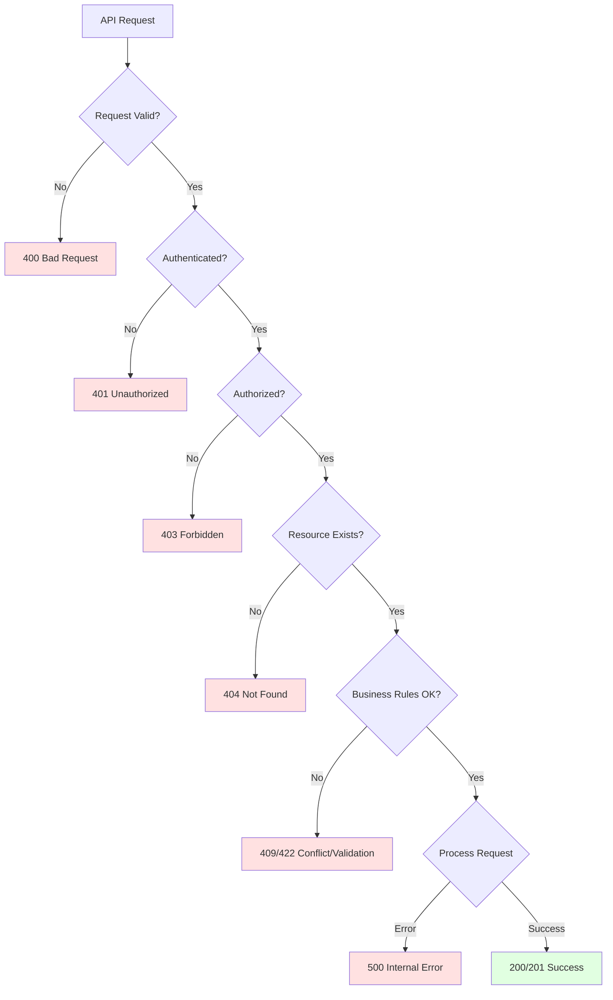

# Error Handling

SaludYa API uses standard HTTP status codes and provides detailed error responses to help you diagnose and resolve issues quickly. This guide covers error formats, common error scenarios, and best practices for error handling.

## Error Response Format

All error responses follow a consistent JSON structure:

```json
{
  "success": false,
  "error": {
    "code": "ERROR_CODE",
    "message": "Human-readable error description",
    "details": {
      "field": "Additional context about the error"
    },
    "timestamp": "2026-03-06T10:30:00Z",
    "requestId": "req_1234567890abcdef"
  }
}
```

### Error Response Fields

| Field | Type | Description |
|-------|------|-------------|
| `success` | boolean | Always `false` for error responses |
| `error.code` | string | Machine-readable error code for programmatic handling |
| `error.message` | string | Human-readable error description |
| `error.details` | object | Additional context (validation errors, field-specific issues) |
| `error.timestamp` | string | ISO 8601 timestamp when the error occurred |
| `error.requestId` | string | Unique identifier for tracking and debugging |

<Info>
Include the `requestId` when contacting support to help us diagnose issues faster.
</Info>

## HTTP Status Codes

SaludYa API uses standard HTTP status codes to indicate the outcome of requests:

### 2xx Success

| Code | Status | Description |
|------|--------|-------------|
| 200 | OK | Request succeeded |
| 201 | Created | Resource created successfully |
| 204 | No Content | Request succeeded with no response body |

### 4xx Client Errors

| Code | Status | Description | Common Causes |
|------|--------|-------------|---------------|
| 400 | Bad Request | Invalid request format or parameters | Missing required fields, invalid data types |
| 401 | Unauthorized | Authentication required or failed | Missing/invalid API key or token |
| 403 | Forbidden | Insufficient permissions | User role lacks access to resource |
| 404 | Not Found | Resource doesn't exist | Invalid appointment ID, deleted record |
| 409 | Conflict | Request conflicts with current state | Duplicate appointment, scheduling conflict |
| 422 | Unprocessable Entity | Validation failed | Business rule violation |
| 429 | Too Many Requests | Rate limit exceeded | Too many requests in time window |

### 5xx Server Errors

| Code | Status | Description | Action |
|------|--------|-------------|--------|
| 500 | Internal Server Error | Unexpected server error | Retry request, contact support if persists |
| 502 | Bad Gateway | Upstream service error | Temporary issue, retry with backoff |
| 503 | Service Unavailable | Service temporarily down | Check status page, retry later |
| 504 | Gateway Timeout | Request timeout | Retry with exponential backoff |

## Error Code Reference

### Authentication Errors (401)

```json
{
  "success": false,
  "error": {
    "code": "UNAUTHORIZED",
    "message": "Authentication credentials are missing or invalid",
    "timestamp": "2026-03-06T10:30:00Z",
    "requestId": "req_abc123"
  }
}
```

| Error Code | Description | Solution |
|------------|-------------|----------|
| `UNAUTHORIZED` | No authentication provided | Include API key or bearer token |
| `INVALID_API_KEY` | API key is invalid or revoked | Verify API key, regenerate if needed |
| `TOKEN_EXPIRED` | JWT token has expired | Refresh token or re-authenticate |
| `TOKEN_INVALID` | JWT token is malformed or invalid | Obtain new token through login |

### Authorization Errors (403)

```json
{
  "success": false,
  "error": {
    "code": "FORBIDDEN",
    "message": "You do not have permission to access this resource",
    "details": {
      "requiredRole": "doctor",
      "currentRole": "patient"
    },
    "timestamp": "2026-03-06T10:30:00Z",
    "requestId": "req_def456"
  }
}
```

| Error Code | Description | Solution |
|------------|-------------|----------|
| `FORBIDDEN` | Insufficient permissions | Check user role requirements |
| `INSUFFICIENT_PERMISSIONS` | API key lacks required scope | Update API key permissions |
| `RESOURCE_ACCESS_DENIED` | Cannot access specific resource | Verify ownership or permissions |

### Validation Errors (400, 422)

```json
{
  "success": false,
  "error": {
    "code": "VALIDATION_ERROR",
    "message": "Request validation failed",
    "details": {
      "fields": [
        {
          "field": "dateTime",
          "message": "Appointment date must be in the future",
          "value": "2026-03-01T10:00:00Z"
        },
        {
          "field": "doctorId",
          "message": "Doctor ID is required",
          "value": null
        }
      ]
    },
    "timestamp": "2026-03-06T10:30:00Z",
    "requestId": "req_ghi789"
  }
}
```

| Error Code | Description | Example |
|------------|-------------|----------|
| `VALIDATION_ERROR` | Request data failed validation | Missing required fields, invalid format |
| `INVALID_DATE_TIME` | Date/time format or value invalid | Past date, invalid ISO format |
| `INVALID_PATIENT_ID` | Patient identifier is invalid | Non-existent patient ID |
| `INVALID_DOCTOR_ID` | Doctor identifier is invalid | Non-existent doctor ID |

### Business Logic Errors (409, 422)

```json
{
  "success": false,
  "error": {
    "code": "SCHEDULING_CONFLICT",
    "message": "Doctor is not available at the requested time",
    "details": {
      "doctorId": "doc_67890",
      "requestedTime": "2026-03-15T14:00:00Z",
      "conflictingAppointmentId": "apt_11111",
      "availableSlots": [
        "2026-03-15T15:00:00Z",
        "2026-03-15T16:00:00Z"
      ]
    },
    "timestamp": "2026-03-06T10:30:00Z",
    "requestId": "req_jkl012"
  }
}
```

| Error Code | Description | Context |
|------------|-------------|----------|
| `SCHEDULING_CONFLICT` | Appointment slot unavailable | Doctor already booked, patient has conflict |
| `DOCTOR_UNAVAILABLE` | Doctor not available | Outside working hours, on leave |
| `APPOINTMENT_NOT_CANCELLABLE` | Cannot cancel appointment | Less than 24 hours before appointment |
| `DUPLICATE_APPOINTMENT` | Appointment already exists | Same patient, doctor, and time |
| `INVALID_STATUS_TRANSITION` | Cannot change appointment status | Invalid state transition (e.g., cancelled to confirmed) |

### Resource Errors (404)

```json
{
  "success": false,
  "error": {
    "code": "RESOURCE_NOT_FOUND",
    "message": "Appointment not found",
    "details": {
      "resource": "appointment",
      "id": "apt_99999"
    },
    "timestamp": "2026-03-06T10:30:00Z",
    "requestId": "req_mno345"
  }
}
```

| Error Code | Description |
|------------|-------------|
| `RESOURCE_NOT_FOUND` | Requested resource doesn't exist |
| `APPOINTMENT_NOT_FOUND` | Appointment ID not found |
| `PATIENT_NOT_FOUND` | Patient ID not found |
| `DOCTOR_NOT_FOUND` | Doctor ID not found |

### Rate Limiting Errors (429)

```json
{
  "success": false,
  "error": {
    "code": "RATE_LIMIT_EXCEEDED",
    "message": "Rate limit exceeded. Please try again later.",
    "details": {
      "limit": 100,
      "remaining": 0,
      "resetAt": "2026-03-06T11:00:00Z"
    },
    "timestamp": "2026-03-06T10:30:00Z",
    "requestId": "req_pqr678"
  }
}
```

<Warning>
Default rate limits: 100 requests per minute for authenticated requests, 20 requests per minute for unauthenticated requests.
</Warning>

Rate limit headers are included in all responses:

```
X-RateLimit-Limit: 100
X-RateLimit-Remaining: 45
X-RateLimit-Reset: 1709726400
```

## Error Handling Flow



## Best Practices for Error Handling

### Client-Side Error Handling

```javascript
// Comprehensive error handling example
const axios = require('axios');

class SaludYaClient {
  constructor(apiKey) {
    this.apiKey = apiKey;
    this.baseURL = 'https://api.saludya.com/v1';
  }

  async createAppointment(appointmentData) {
    try {
      const response = await axios.post(
        `${this.baseURL}/appointments`,
        appointmentData,
        {
          headers: {
            'X-API-Key': this.apiKey,
            'Content-Type': 'application/json'
          }
        }
      );

      return response.data;
    } catch (error) {
      return this.handleError(error);
    }
  }

  handleError(error) {
    if (!error.response) {
      // Network error
      throw new Error('Network error: Please check your internet connection');
    }

    const { status, data } = error.response;
    const errorCode = data.error?.code;
    const errorMessage = data.error?.message;
    const requestId = data.error?.requestId;

    // Log for debugging
    console.error(`Error [${requestId}]:`, {
      status,
      code: errorCode,
      message: errorMessage
    });

    switch (status) {
      case 400:
        // Validation errors - show field-specific errors to user
        if (data.error?.details?.fields) {
          const fieldErrors = data.error.details.fields
            .map(f => `${f.field}: ${f.message}`)
            .join(', ');
          throw new Error(`Validation failed: ${fieldErrors}`);
        }
        throw new Error(errorMessage || 'Invalid request');

      case 401:
        // Authentication error - redirect to login or refresh token
        if (errorCode === 'TOKEN_EXPIRED') {
          return this.refreshTokenAndRetry(error.config);
        }
        throw new Error('Authentication required. Please log in.');

      case 403:
        // Authorization error - inform user of insufficient permissions
        throw new Error('You do not have permission to perform this action.');

      case 404:
        // Resource not found
        throw new Error('The requested resource was not found.');

      case 409:
        // Conflict - provide alternative options if available
        if (errorCode === 'SCHEDULING_CONFLICT') {
          const availableSlots = data.error?.details?.availableSlots;
          if (availableSlots) {
            throw new Error(
              `Time slot unavailable. Available times: ${availableSlots.join(', ')}`
            );
          }
        }
        throw new Error(errorMessage || 'Request conflicts with existing data');

      case 422:
        // Business rule validation
        throw new Error(errorMessage || 'Request cannot be processed');

      case 429:
        // Rate limit - implement exponential backoff
        const resetAt = data.error?.details?.resetAt;
        throw new Error(
          `Rate limit exceeded. Please try again at ${resetAt}`
        );

      case 500:
      case 502:
      case 503:
      case 504:
        // Server errors - retry with backoff
        throw new Error(
          `Service temporarily unavailable. Request ID: ${requestId}. Please try again later.`
        );

      default:
        throw new Error(`Unexpected error: ${errorMessage}`);
    }
  }

  async refreshTokenAndRetry(originalRequest) {
    // Implement token refresh logic
    // This is a placeholder
    throw new Error('Session expired. Please log in again.');
  }
}

// Usage
const client = new SaludYaClient(process.env.SALUDYA_API_KEY);

try {
  const appointment = await client.createAppointment({
    patientId: 'pat_12345',
    doctorId: 'doc_67890',
    dateTime: '2026-03-15T14:00:00Z',
    reason: 'Annual checkup'
  });
  console.log('Appointment created:', appointment);
} catch (error) {
  console.error('Failed to create appointment:', error.message);
  // Show error to user in UI
}
```

### Retry Logic with Exponential Backoff

```javascript
class RetryHelper {
  static async withRetry(fn, maxRetries = 3, baseDelay = 1000) {
    for (let attempt = 0; attempt <= maxRetries; attempt++) {
      try {
        return await fn();
      } catch (error) {
        const isRetryable = this.isRetryableError(error);
        const isLastAttempt = attempt === maxRetries;

        if (!isRetryable || isLastAttempt) {
          throw error;
        }

        // Exponential backoff: 1s, 2s, 4s, 8s...
        const delay = baseDelay * Math.pow(2, attempt);
        console.log(`Retry attempt ${attempt + 1} after ${delay}ms`);
        
        await this.sleep(delay);
      }
    }
  }

  static isRetryableError(error) {
    if (!error.response) {
      // Network errors are retryable
      return true;
    }

    const status = error.response.status;
    // Retry on server errors and rate limiting
    return status === 429 || status >= 500;
  }

  static sleep(ms) {
    return new Promise(resolve => setTimeout(resolve, ms));
  }
}

// Usage
const appointment = await RetryHelper.withRetry(() =>
  client.createAppointment(appointmentData)
);
```

### Server-Side Error Handling

```javascript
// Custom error classes
class AppError extends Error {
  constructor(message, statusCode, errorCode, details = {}) {
    super(message);
    this.statusCode = statusCode;
    this.errorCode = errorCode;
    this.details = details;
    this.isOperational = true;
  }
}

class ValidationError extends AppError {
  constructor(message, fields = []) {
    super(message, 422, 'VALIDATION_ERROR', { fields });
  }
}

class SchedulingConflictError extends AppError {
  constructor(message, details) {
    super(message, 409, 'SCHEDULING_CONFLICT', details);
  }
}

// Error handling middleware
const errorHandler = (err, req, res, next) => {
  const requestId = req.id || generateRequestId();
  
  // Log error for monitoring
  console.error(`[${requestId}] Error:`, {
    error: err.message,
    stack: err.stack,
    url: req.url,
    method: req.method,
    user: req.user?.id
  });

  // Don't leak error details in production
  const isDevelopment = process.env.NODE_ENV === 'development';

  if (err.isOperational) {
    // Operational error - safe to send to client
    return res.status(err.statusCode).json({
      success: false,
      error: {
        code: err.errorCode,
        message: err.message,
        details: err.details,
        timestamp: new Date().toISOString(),
        requestId
      }
    });
  }

  // Programming or unknown error - don't leak details
  res.status(500).json({
    success: false,
    error: {
      code: 'INTERNAL_SERVER_ERROR',
      message: isDevelopment 
        ? err.message 
        : 'An unexpected error occurred',
      timestamp: new Date().toISOString(),
      requestId
    }
  });
};

// Usage in service layer
class AppointmentService {
  async scheduleAppointment(appointmentData) {
    // Validate data
    const validationErrors = this.validateAppointmentData(appointmentData);
    if (validationErrors.length > 0) {
      throw new ValidationError('Request validation failed', validationErrors);
    }

    // Check for conflicts
    const hasConflict = await this.checkSchedulingConflict(appointmentData);
    if (hasConflict) {
      const availableSlots = await this.getAvailableSlots(
        appointmentData.doctorId,
        appointmentData.dateTime
      );
      
      throw new SchedulingConflictError(
        'Doctor is not available at the requested time',
        {
          doctorId: appointmentData.doctorId,
          requestedTime: appointmentData.dateTime,
          availableSlots
        }
      );
    }

    // Create appointment
    return await this.appointmentRepository.create(appointmentData);
  }
}
```

<Note>
**Error Handling Best Practices:**
- Always validate input at the controller level
- Use custom error classes for different error types
- Include request IDs for tracing
- Implement retry logic for transient failures
- Log errors for monitoring and debugging
- Don't expose sensitive information in error messages
</Note>

## Debugging Errors

### Using Request IDs

Every error response includes a unique `requestId`. Use this when:
- Reporting issues to support
- Searching logs
- Tracking user-reported errors

```bash
# Search logs by request ID
grep "req_abc123" /var/log/saludya/api.log
```

### Common Troubleshooting Steps

1. **Check authentication**: Verify API key or token is valid and not expired
2. **Validate request data**: Ensure all required fields are present and correctly formatted
3. **Check permissions**: Verify user role has access to the endpoint
4. **Review error details**: Look at `error.details` for specific field errors or suggestions
5. **Check rate limits**: Review rate limit headers to ensure you're not exceeding limits
6. **Verify resource existence**: Confirm IDs reference existing resources
7. **Check API status**: Visit https://status.saludya.com for service status

<Info>
For persistent issues, contact support at api-support@saludya.com with the request ID.
</Info>